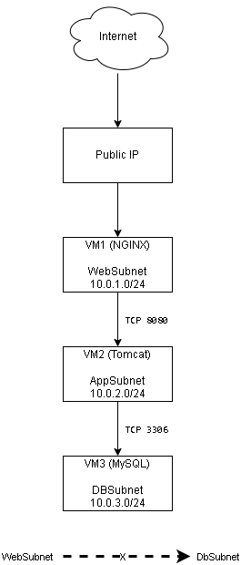
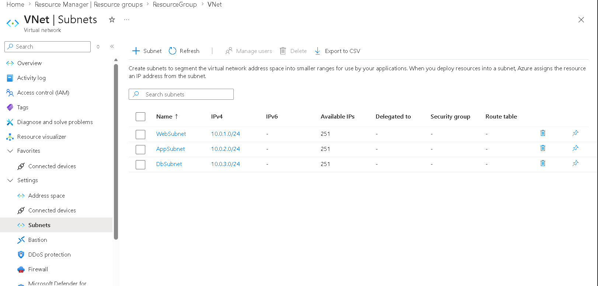
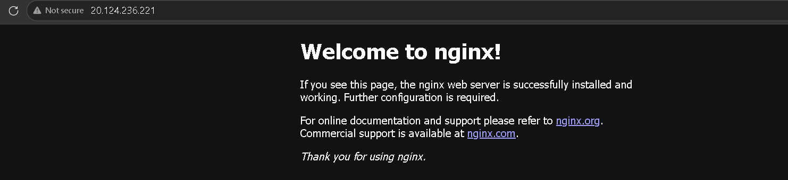
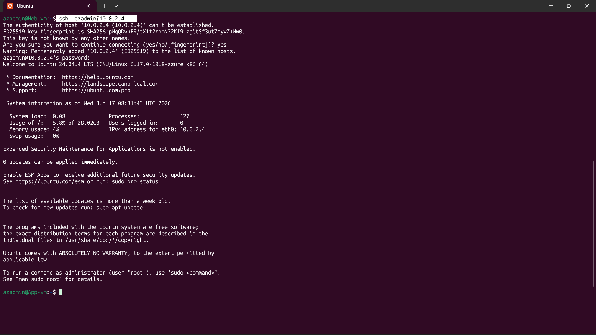

# Azure Three-Tier Architecture with NGINX, Tomcat, and MySQL

## Overview

This project demonstrates the deployment of a secure three-tier application architecture on Microsoft Azure.

The environment consists of:

* Web Tier: NGINX
* Application Tier: Apache Tomcat
* Database Tier: MySQL

The goal is to implement network segmentation, controlled east-west traffic, and secure administrative access using a jump-host approach.

## Architecture Diagram



## Architecture Components

| Component | Purpose                           | Access          |
| --------- | --------------------------------- | --------------- |
| Web VM    | Hosts NGINX and acts as jump host | Public IP       |
| App VM    | Hosts Apache Tomcat               | Private IP only |
| DB VM     | Hosts MySQL                       | Private IP only |

## Network Design

### Virtual Network

* Address Space: `10.0.0.0/16`

### Subnets

| Subnet    | CIDR          |
| --------- | ------------- |
| WebSubnet | `10.0.1.0/24` |
| AppSubnet | `10.0.2.0/24` |
| DBSubnet  | `10.0.3.0/24` |

## Security Design

### Inbound Access

| Source    | Destination | Port | Purpose               |
| --------- | ----------- | ---- | --------------------- |
| Internet  | Web VM      | 22   | SSH                   |
| Internet  | Web VM      | 80   | HTTP                  |
| WebSubnet | AppSubnet   | 22   | Administrative access |
| WebSubnet | AppSubnet   | 8080 | Application traffic   |
| AppSubnet | DBSubnet    | 22   | Administrative access |
| AppSubnet | DBSubnet    | 3306 | Database traffic      |

### Deny Rules

| Source    | Destination | Action |
| --------- | ----------- | ------ |
| WebSubnet | DBSubnet    | Deny   |

This ensures the web tier cannot directly access the database tier.

## Administrative Access Flow

```text
Laptop
  │
  ▼
Web VM (Public IP)
  │
  ▼
App VM (Private IP)
  │
  ▼
DB VM (Private IP)
```

Example SSH workflow:

```bash
ssh azureuser@<web-vm-public-ip>

ssh azureuser@<app-vm-private-ip>

ssh azureuser@<db-vm-private-ip>
```

## Services Installed

### Web Tier

* Ubuntu Server
* NGINX

### Application Tier

* Ubuntu Server
* OpenJDK
* Apache Tomcat

### Database Tier

* Ubuntu Server
* MySQL

Installation scripts are available in the `scripts/` directory.

## Deployment Steps

1. Create a resource group.
2. Create a virtual network with three subnets.
3. Deploy the web VM with a public IP.
4. Deploy application and database VMs with private IPs only.
5. Configure Network Security Groups.
6. Install NGINX, Tomcat, and MySQL.
7. Validate connectivity between tiers.
8. Verify that Web → DB communication is blocked.

Detailed instructions are available in:

```text
docs/project-documentation.md
```

## Validation

### Successful Connections

* Web VM → App VM on TCP 8080
* App VM → DB VM on TCP 3306
* Web VM → App VM on TCP 22
* App VM → DB VM on TCP 22

### Blocked Connections

* Web VM → DB VM on Any * port

Connectivity tests were performed using:

```bash
nc -zv <private-ip> <port>
```

## Screenshots

### Virtual Network and Subnets



### NGINX Running



### SSH Jump Host Access



### Web-to-Database Traffic Blocked


## Repository Structure

```text
azure-three-tier-architecture/
├── README.md
├── architecture/
├── screenshots/
├── scripts/
└── docs/
```

## Key Learnings

* Azure Virtual Networks
* Subnet design
* Network Security Groups
* Jump-host architecture
* Secure administrative access
* East-west traffic control
* Three-tier application design

## Future Improvements

* Automate deployment using Terraform
* Replace jump host with Azure Bastion
* Configure NGINX as a reverse proxy
* Integrate Tomcat with MySQL
* Add Azure Monitor and Log Analytics
* Store secrets in Azure Key Vault

## Author

Your Name

* LinkedIn: <your-linkedin-url>
* GitHub: <your-github-profile>
